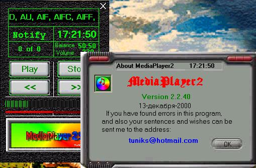



## MediaPlayer2 SX v2\.2\.1\(New\)

### Description

Universal MediaPlayer SX v2.00. Considerably (on my sight) the design is improved, are supplemented slider regulators of balance and volume (is watched also regulations from a mixer). The regulator of a bar of search is supplemented. The detected errors are corrected. It can play files of the following types WAV, SND, AU, AIF, AIFC, AIFF, MID, RMI, MP3, M3U, M1V, MP2, MPA, MPE, MPEG, ASF, ASX, MOV, QT, RA, RM, RAM, RMM, AVI, DAT. There is a possibility to create the lists of a sequence of playing them. A basis MSDXM.OCX. Registers myself and list in REGISTRY. I am sorry for mine English.
 
### More Info
 

             |
---                |---
**Submitted On**   |2000-12-13 22:07:06
**By**             |[Nik Tupkalov](https://github.com/Planet-Source-Code/PSCIndex/blob/master/ByAuthor/nik-tupkalov.md)
**Level**          |Beginner
**User Rating**    |3.6 (18 globes from 5 users)
**Compatibility**  |VB 4\.0 \(32\-bit\), VB 5\.0, VB 6\.0
**Category**       |[Sound/MP3](https://github.com/Planet-Source-Code/PSCIndex/blob/master/ByCategory/sound-mp3__1-45.md)
**World**          |[Visual Basic](https://github.com/Planet-Source-Code/PSCIndex/blob/master/ByWorld/visual-basic.md)
**Archive File**   |[CODE\_UPLOAD1267512132000\.zip](https://github.com/Planet-Source-Code/nik-tupkalov-mediaplayer2-sx-v2-2-1-new__1-13350/archive/master.zip)

